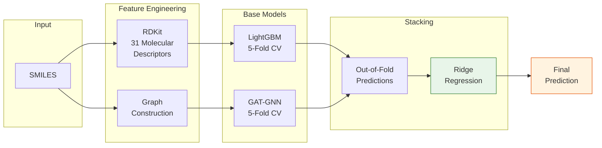

<div align="center">

# CYP3A4 Inhibition Predictor
**CYP3A4 효소 저해율 예측을 위한 LightGBM + GNN Stacking Ensemble**


**🏆 최종 2위 · 한국화학연구원장상 | 2025 AI 신약개발 경진대회**

</div>

---

## Highlights

| 단계 | 순위 |
|------|------|
| Public Leaderboard | 6위 |
| Private Leaderboard | 5위 |
| **최종 (발표 심사 포함)** | **2위** |

- Public → Private 전환 시에도 **안정적 순위 유지** (Shake-up 강건성)
- 한국화학연구원장상 수상

---

## 대회 소개

**Boost up AI 2025 신약 개발 경진대회**

| 항목 | 내용 |
|------|------|
| 주최 | 한국화학연구원 · 한국생명공학연구원 |
| 과제 | CYP3A4 효소 저해율(%) 예측 (Regression) |
| 평가 지표 | `Score = 0.5 × (1 − NRMSE) + 0.5 × PCC` |
| 학습 데이터 | 1,681 화합물 |
| 테스트 데이터 | 100 화합물 |
| 입력 | SMILES (Canonical) |

> CYP3A4는 간에서 약물 대사의 ~50%를 담당하는 핵심 효소로, 저해율 예측은 신약 후보물질의 약물 상호작용(DDI) 위험도 평가에 직결됩니다.

---

## Solution Architecture



**핵심 아이디어**: 전통적 분자 기술자(Feature Engineering)와 그래프 기반 표현(Graph Representation)의 **상보적 조합**을 통해, 단일 모델의 한계를 극복하는 Stacking Ensemble을 구성했습니다.

---

## 접근 방법 상세

### Base Model 1 — LightGBM

RDKit으로 추출한 **31개 분자 기술자**를 입력으로 사용합니다.

| Hyperparameter | Value |
|---|---|
| `learning_rate` | 0.0881 |
| `num_leaves` | 273 |
| `max_depth` | 3 |
| `subsample` | 0.999 |
| `colsample_bytree` | 0.998 |
| `reg_alpha` | 1.56e-08 |
| `reg_lambda` | 4.33e-05 |
| `n_estimators` | 2,000 (early stopping 100) |
| `objective` | `regression_l1` |

### Base Model 2 — Graph Attention Network (GAT)

분자를 그래프로 변환하여 원자 간 관계를 직접 학습합니다.

| 구성 요소 | 차원 | 설명 |
|---|---|---|
| Node Features | 22D | 원자 타입 one-hot (10) + 원자 속성 (12) |
| Edge Features | 6D | 결합 타입 (4) + conjugation + ring 여부 |
| Global Features | 6D | MW, LogP, TPSA, SMILES 길이, 패턴 |

**아키텍처**:
- GAT 4-layer, 4 attention heads (마지막 layer: 1 head)
- Hidden dimension: 64
- Global pooling: mean + max concatenation
- MLP predictor: 160 → 256 → 128 → 1
- Dropout: 0.176, Epochs: 150 (early stopping patience 20)

### Meta Model — Stacking Ensemble

- **Ridge Regression** (alpha=1.0)
- LightGBM OOF + GNN OOF predictions를 메타 feature로 학습
- Out-of-Fold 방식으로 데이터 누수 없이 과적합 방지

---

## Feature Engineering

LightGBM에 사용된 **31개 분자 기술자**를 카테고리별로 정리했습니다.

| 카테고리 | Features | 개수 |
|---|---|---|
| **기본 분자 속성** | MW, LogP, TPSA, NumHDonors, NumHAcceptors, NumRotatableBonds, NumAromaticRings, NumHeteroatoms | 8 |
| **원자 카운트** | NumCarbon, NumNitrogen, NumOxygen, NumSulfur, NumFluorine, NumChlorine, NumBromine | 7 |
| **구조 특성** | NumRings, NumHeavyAtoms, FractionCSP3, NumSaturatedRings, NumAliphaticRings | 5 |
| **복잡도** | BertzCT, MolMR | 2 |
| **극성 지표** | NumPolarAtoms, PolarRatio | 2 |
| **SMILES 기반** | SmilesLength | 1 |
| **구조 패턴 감지** | HasAmide, HasPhenyl, HasTrifluoromethyl, HasMorpholine, HasPiperidine, NumBranches | 6 |

---

## 프로젝트 구조

```
├── train.py               # 전체 학습 (LightGBM + GNN + Stacking)
├── inference.py            # 학습된 모델로 추론
├── run.py                  # 환경 체크 → 학습 → 추론 일괄 실행
├── requirements.txt        # 의존성
├── train.csv               # 학습 데이터 (1,681 samples)
├── test.csv                # 테스트 데이터 (100 samples)
├── sample_submission.csv   # 제출 양식
├── models/                 # 학습된 모델 가중치
│   ├── lgbm_fold_0~4.pkl       # LightGBM 5-Fold 모델
│   ├── gnn_fold_0~4.pth        # GNN 5-Fold 모델
│   ├── stacking_meta_model.pkl # Ridge meta model
│   ├── lgbm_test_preds.npy     # LightGBM 테스트 예측
│   └── gnn_test_preds.npy      # GNN 테스트 예측
└── outputs/                # 예측 결과 CSV
```

---

## Quick Start

### Requirements

```bash
pip install -r requirements.txt
```

> **Note**: `numpy<2` 버전이 필요합니다. 설치 후 런타임 재시작이 필요할 수 있습니다.

### Training

```bash
python train.py
```

5-Fold CV로 LightGBM과 GNN을 각각 학습한 뒤, Out-of-Fold predictions로 Ridge meta model을 학습합니다. 모든 가중치는 `models/` 디렉토리에 자동 저장됩니다.

### Inference

```bash
python inference.py
```

저장된 모델 가중치를 불러와 테스트 데이터에 대한 최종 예측을 생성합니다.

### Full Pipeline

```bash
python run.py
```

환경 체크 → 학습 → 추론 → 결과 검증을 순차적으로 실행합니다.

<details>
<summary><b>Google Colab 환경</b></summary>

```bash
# 1. 레포지토리 클론
!git clone https://github.com/developwho/Boostup-AI-2025-Drug-Dev.git
%cd Boostup-AI-2025-Drug-Dev

# 2. 의존성 설치 (numpy<2 먼저 설치 후 런타임 재시작)
!pip install 'numpy<2'
# ⚠️ 런타임 재시작 필요
!pip install rdkit-pypi torch_geometric -q

# 3. 학습 또는 추론
!python train.py      # 전체 학습
!python inference.py   # 추론만
```

</details>

---

## Key Takeaways

1. **Feature Engineering + Graph Representation의 상보성** — 전통적 분자 기술자가 포착하는 전역 속성과, GNN이 학습하는 국소 원자 간 상호작용이 서로 보완하여 성능을 끌어올림
2. **Stacking의 안정성** — 단일 모델 대비 Public ↔ Private 간 순위 변동이 적어 Shake-up에 강건한 결과를 달성
3. **도메인 지식 기반 Feature의 중요성** — CYP3A4 저해와 관련된 약물 화학적 패턴(Amide, Phenyl, Morpholine 등)을 명시적으로 feature화한 것이 예측력 향상에 기여

---

## Tech Stack


---

## License

This project is licensed under the MIT License.
